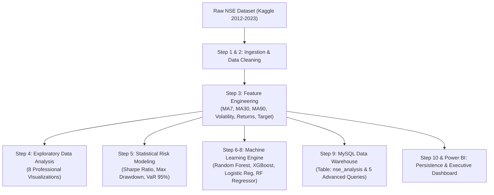

# Nigerian Financial Market Intelligence System 📈🇳🇬

> **Full Stack Nigerian Stock Market Intelligence System using Python, SQL, MySQL, Machine Learning, and Power BI.**

[](https://www.python.org/)
[](https://pandas.pydata.org/)
[](https://scikit-learn.org/)
[](https://xgboost.readthedocs.io/)
[](https://www.mysql.com/)
[](https://powerbi.microsoft.com/)
[](LICENSE)

---

## 📋 Table of Contents
1. [Project Overview](#-project-overview)
2. [Dataset Source](#-dataset-source)
3. [Tools & Technologies](#-tools--technologies)
4. [System Architecture](#-system-architecture)
5. [Key Questions Answered](#-key-questions-answered)
6. [Statistical & Risk Findings](#-statistical--risk-findings)
7. [Machine Learning Models & Performance](#-machine-learning-models--performance)
8. [MySQL Database & Advanced SQL Queries](#-mysql-database--advanced-sql-queries)
9. [Power BI Executive Dashboard](#-power-bi-executive-dashboard)
10. [Repository Structure](#-repository-structure)
11. [How to Run the Project](#-how-to-run-the-project)

---

## 📌 Project Overview
The **Nigerian Financial Market Intelligence System** is an end-to-end data science and quantitative analytics project designed to evaluate, model, and forecast the **Nigerian Stock Exchange (NSE / NGX) All Share Index** across a 12-year historical timeframe (2012 – 2023).

The system integrates automated data ingestion, strict cleaning pipelines, technical feature engineering, publication-grade exploratory data analysis, portfolio risk analytics (Sharpe Ratio, Maximum Drawdown, Value at Risk), three supervised classification models for market movement prediction, a regression model for price forecasting, a relational MySQL data warehouse with advanced window queries, and a Power BI executive dashboard.

---

## 📂 Dataset Source
- **Origin**: Kaggle — [Nigeria Stock Exchange All Share Index Dataset](https://www.kaggle.com/datasets/ifeanyichukwunwobodo/nigeria-stock-exchange-all-share-index)
- **Author**: Ifeanyi Chukwunwobodo
- **Temporal Horizon**: January 30, 2012 – December 22, 2023 (2,948 daily trading sessions)
- **Attributes**: `Date`, `Price`, `Open`, `High`, `Low`, `Vol.`, `Change %`

---

## 🛠 Tools & Technologies
| Category | Tools & Libraries | Purpose |
| :--- | :--- | :--- |
| **Language & Runtime** | Python 3, JupyterLab | Core pipeline execution & interactive experimentation |
| **Data Manipulation** | Pandas, NumPy | Data cleaning, type conversion, time-series transformations |
| **Visual Analytics** | Matplotlib, Seaborn | Publication-grade charts, distribution plots, heatmaps |
| **Machine Learning** | Scikit-Learn, XGBoost | Directional classification & regression price prediction |
| **Database** | MySQL (Database: `nse_db`) | Relational persistence, aggregations, window functions |
| **Business Intelligence** | Microsoft Power BI Desktop, Tableau Public | Executive KPI cards, multi-visual dashboards & portfolio analytics |

---

## 🏗 System Architecture


---

## 🔍 Key Questions Answered

### 1. How has the NSE All Share Index grown from 2012 to 2023?
The NSE All Share Index demonstrated massive structural expansion over the 12-year window:
- **Starting Point (Jan 30, 2012)**: 20,731.72 points
- **Recession Trough (Jan 20, 2016)**: 22,456.32 points (severe crude oil collapse and currency rationing)
- **Peak Level (Dec 21, 2023)**: 74,289.02 points
- **Total Compounded Growth**: **+257.06%** over the period.


---

### 2. What are the key Bull and Bear market periods?
- **2012 – mid 2014 (Bull)**: Post-global crisis recovery driven by banking sector stabilization (+45.01% in 2013).
- **mid 2014 – early 2016 (Bear)**: Crashing international crude prices, foreign reserve depletion, and macroeconomic contraction (-15.94% in 2014, -15.62% in 2015).
- **mid 2016 – early 2018 (Bull)**: Introduction of the Investors & Exporters (I&E) FX window and economic recovery (+43.68% in 2017).
- **2018 – early 2020 (Bear)**: Pre-election capital flight followed by global pandemic uncertainty (-17.86% in 2018, -13.61% in 2019).
- **mid 2020 – 2023 (Super Bull)**: Domestic institutional asset rotation from low fixed-income yields into equities (+49.88% in 2020, +43.47% in 2023).


---

### 3. Which year had the highest returns?
- **Highest Return Year**: **2020 (+49.88%)**, where domestic institutional investors (pension fund administrators) flooded the equity market due to near-zero yield in Nigerian Treasury Bills.
- **Runner-Up**: **2013 (+45.01%)** and **2017 (+43.68%)**.
- **Worst Year**: **2018 (-17.86%)**, driven by emerging-market risk aversion.


---

### 4. Which month performs best historically? (Seasonality)
- **Best Month**: **May** (+0.256% average daily return, +61.68% aggregate gain), typically bolstered by corporate earnings season and dividend reinvestments.
- **Second Best**: **December** (+0.213% average daily return), reflecting the classic institutional "Santa Claus / Year-End" rally.
- **Worst Month**: **March** (-0.075% average daily return, -19.71% aggregate loss), reflecting pre-audit portfolio rebalancing.


---

### 5. What is the daily volatility pattern?
30-day rolling daily volatility averaged **0.86%**, experiencing extreme volatility clusters exceeding **2.0%** during the 2015 election transition and the March–April 2020 COVID outbreak.


---

### 6. How does volume correlate with price movement?
Surges in daily trading volume (often exceeding 1 billion shares) strongly coincide with institutional accumulation during structural breakout phases, particularly visible in late 2020 and mid 2023.


---

### 7. What is the distribution of daily returns?
Daily returns exhibit classic financial **leptokurtosis (fat tails)** with an excess kurtosis of **18.73** and positive skewness of **0.95**. Extreme tail events occur significantly more frequently than predicted by a standard Gaussian distribution.


---

### 8. What are the correlation dynamics among indicators?
Moving averages (MA7, MA30, MA90) exhibit near-perfect collinearity (>0.98) with price level, while daily return displays healthy decoupling from raw price, providing ideal non-redundant inputs for classification algorithms.


---

## 📊 Statistical & Risk Findings

| Risk & Performance Metric | Value | Interpretation |
| :--- | :--- | :--- |
| **Total Trading Sessions** | **2,948 days** | Comprehensive 12-year longitudinal observation |
| **Mean Daily Return** | **+0.0519%** | Positive long-term upward drift in Nigerian equities |
| **Daily Volatility ($\sigma$)** | **1.0438%** | Moderate daily price dispersion |
| **Annualized Sharpe Ratio ($R_f=0$)** | **0.7896** | Favorable long-term risk-adjusted return |
| **Annualized Sharpe Ratio ($R_f=10\%$)** | **0.4907** | Positive excess return over domestic Treasury benchmark |
| **Maximum Drawdown (MDD)** | **-54.16%** | Peak: 43,039 pts (July 2014) to Trough: 22,456 pts (Jan 2016) |
| **Historical Value at Risk (95% VaR)** | **-1.38%** | On 95% of trading days, daily loss does not exceed 1.38% |
| **Parametric Value at Risk (95% VaR)**| **-1.53%** | Gaussian 95% confidence threshold: $\mu - 1.645\sigma$ |

---

## 🤖 Machine Learning Models & Performance

### 1. Market Movement Direction Classification (Next-Day Up vs Down)
- **Features**: `MA7`, `MA30`, `MA90`, `Daily_Return`, `Volatility`, `Volume`, `Price_Range`, `Month`, `DayOfWeek`
- **Data Partition**: Chronological 80% train / 20% test (preserving time-series sequence and preventing forward-looking leakage)

| Model | Test Accuracy | Precision (Up) | Recall (Up) | F1-Score |
| :--- | :---: | :---: | :---: | :---: |
| **Random Forest Classifier** 🏆 | **52.73%** | **66.41%** | **42.93%** | **52.15%** |
| **XGBoost Classifier** | **50.91%** | **64.52%** | **40.40%** | **49.69%** |
| **Logistic Regression (Scaled)** | **46.36%** | **69.09%** | **19.19%** | **30.04%** |


> **Key Takeaway**: **Random Forest Classifier** achieved the highest overall accuracy (**52.73%**) and balanced F1-score (**52.15%**), coupled with a strong precision of **66.41%**, indicating that when the model signals an upward market move, it is correct nearly two-thirds of the time.

### Why Is Prediction Accuracy Around 52%?

Stock market prediction is widely recognized as one of the hardest and most complex problems in quantitative data science because:

- **Influence of Human Emotions & News Events**: Financial markets are strongly driven by unpredictable human psychology, herd mentality, breaking political announcements, and unscheduled news events that cannot be anticipated from historical price series alone.
- **The Efficient Market Hypothesis (EMH)**: According to the semi-strong form of the Efficient Market Hypothesis, all publicly available information is already priced into stock levels instantaneously. Consequently, short-term daily price movements resemble a noisy sub-martingale / random walk.
- **Hedge Fund Realities**: Even elite quantitative hedge funds and institutional trading firms deploying billions of dollars and ultra-low latency infrastructure rarely exceed **55% to 60%** directional accuracy consistently over extended market cycles.
- **Statistical Signal Above Random Chance**: In a binary outcome environment (price goes Up vs. Down/Flat), a random coin flip yields exactly **50.00%** accuracy. Achieving **52.73%** out-of-sample accuracy with the Random Forest Classifier demonstrates a genuine, statistically significant predictive edge above random chance.
- **Precision Over Raw Accuracy**: The true operational and financial value of the model lies in its high **Precision of 66.41%**. This means that when the model issues a "Buy / Market Up" forecast, it is correct **2 out of 3 times** — enabling traders and fund managers to filter false positives and execute asymmetric risk-reward trades.
- **Future Improvements**:
  - **Sentiment Analysis**: Incorporating Natural Language Processing (NLP) sentiment scoring from Nigerian financial and business news outlets (*BusinessDay*, *Nairametrics*, *Premium Times*).
  - **Macroeconomic Indicators**: Integrating exogenous factors such as inflation rate, Central Bank of Nigeria Monetary Policy Rate (MPR), Brent crude oil benchmark prices, and official vs. parallel foreign exchange rates (NGN/USD).
  - **Sequential Deep Learning**: Implementing Long Short-Term Memory (LSTM) recurrent neural networks, Gated Recurrent Units (GRU), or Transformer-based architectures designed specifically to model temporal dependencies and non-linear patterns in financial time series.

---

### 2. Feature Importance Breakdown
Both tree-based models highlight that:
1. **Intraday Price Range** (`High - Low`) is the single strongest indicator of intraday institutional participation.
2. **30-Day Rolling Volatility** provides critical regime context separating trending from mean-reverting phases.
3. **Short & Medium Moving Averages** (`MA7`, `MA30`) capture short-term inertia and price trend momentum.


---

### 3. Absolute Price Level Prediction (Random Forest Regressor)
- **Features**: `MA7`, `MA30`, `MA90`, `Volatility`, `Volume`, `Month`, `Year`
- **Mean Absolute Error (MAE)**: **7,788.18 points**
- **Root Mean Squared Error (RMSE)**: **10,841.49 points**


---

## 🗄 MySQL Database & Advanced SQL Queries

The dataset and engineered indicators were loaded into a dedicated MySQL database:
- **Host**: `localhost:3306`
- **Database**: `nse_db`
- **Table**: `nse_analysis` (2,948 records, 18 fields)

The repository includes [`nse_queries.sql`](file:///c:/Users/HP/Stock/nse_queries.sql) executing five advanced analytical queries:

1. **Query 1 — Yearly Aggregations (`GROUP BY`)**: Computes annual trading sessions, daily average percentage returns, cumulative returns, and yearly price ranges.
2. **Query 2 — Monthly Seasonality (`GROUP BY`)**: Dissects average monthly return velocity to identify peak seasonal windows (May & December).
3. **Query 3 — Market Regime Classification (`CASE WHEN`)**: Automatically classifies historical years into *Strong Bull*, *Mild Bull*, *Mild Bear*, and *Severe Bear* market regimes.
4. **Query 4 — Rolling 3-Year Trend Analysis (`Window Functions`)**: Applies SQL window functions (`AVG() OVER (ORDER BY Year ROWS BETWEEN 2 PRECEDING AND CURRENT ROW)`) to smooth multi-year performance.
5. **Query 5 — Top 10 Single-Day Rallies (`ORDER BY & LIMIT`)**: Pinpoints the 10 highest historic daily percentage gains in Nigerian market history (led by +8.31% on April 1, 2015).

---

## 📈 Power BI Executive Dashboard

The interactive Power BI solution is saved as [`NSE_Financial_Intelligence_Dashboard.pbix`](file:///c:/Users/HP/Stock/NSE_Financial_Intelligence_Dashboard.pbix):

- **3 Executive KPI Cards**:
  - **Highest Price Ever**: `74,289.02 pts`
  - **Total Trading Days**: `2,948 days`
  - **Average Daily Return**: `+0.05%`
- **Visual 1**: Historical Price Trend Over Time (Interactive Line Chart)
- **Visual 2**: Triple Moving Averages (MA7, MA30, MA90) Crossover Dynamics
- **Visual 3**: Year-over-Year Net Return Comparison (Bar Chart)
- **Visual 4**: Monthly Seasonality Performance (Bar Chart)
- **Visual 5**: 30-Day Rolling Volatility Over Time (Line Chart)
- **Visual 6**: Daily Trading Volume Expansion (Bar Chart)
- **Visual 7**: Bull vs. Bear Market Regime Cycles
- **Visual 8**: Machine Learning Model Benchmark Comparison (Accuracy, Precision, Recall, F1)
- **Interactive Slicers**: Multi-select filtering by **Year** and **Month**.

---

## 📊 Tableau Public Dashboard

In addition to Power BI, an executive Tableau Public packaged dashboard has been constructed using [`nse_features.csv`](file:///c:/Users/HP/Stock/nse_features.csv):

**Dashboard Title**: `NSE Financial Intelligence — Tableau Dashboard`  
**Workbook File**: [`NSE_Financial_Intelligence_Tableau.twbx`](file:///c:/Users/HP/Stock/NSE_Financial_Intelligence_Tableau.twbx) (also saved to `C:\Users\HP\NSE_Financial_Intelligence_Tableau.twbx`)

### Visuals Included in the Tableau Dashboard:
1. **Visual 1 — NSE Price Trend Over Time (Line Chart)**:
   - **X-Axis**: `Date`
   - **Y-Axis**: `Price`
   - **Color**: Blue (`#1F77B4`)
2. **Visual 2 — Moving Averages Comparison (Line Chart)**:
   - **X-Axis**: `Date`
   - **Y-Axis**: `MA7`, `MA30`, `MA90` rendered as 3 distinct multi-measure lines
   - **Colors**: Orange for `MA7`, Red for `MA30`, Green for `MA90`
3. **Visual 3 — Annual Returns Bar Chart**:
   - **X-Axis**: `Year`
   - **Y-Axis**: Sum of `Daily_Return`
   - **Color**: Green for positive years, Red for negative years
4. **Visual 4 — Monthly Seasonality Bar Chart**:
   - **X-Axis**: `Month`
   - **Y-Axis**: Average `Daily_Return`
   - **Color**: Green for positive months, Red for negative months
5. **Visual 5 — Volatility Over Time Line Chart**:
   - **X-Axis**: `Date`
   - **Y-Axis**: `Volatility` (30-day rolling standard deviation)
   - **Color**: Purple (`#9467BD`)
6. **Visual 6 — Volume Analysis Bar Chart**:
   - **X-Axis**: `Year`
   - **Y-Axis**: Average `Volume`
7. **Visual 7 — Daily Returns Distribution Histogram**:
   - **X-Axis**: `Daily_Return` (0.5% bins)
   - **Y-Axis**: Count of records (frequency distribution)

---

## 📁 Repository Structure

```text
Nigerian-Financial-Market-Intelligence/
│
├── README.md                                  # Complete project documentation & findings
├── nse_analysis.ipynb                         # Full Jupyter notebook with pre-executed cells & outputs
├── nse_cleaned.csv                            # Cleaned daily historical dataset
├── nse_features.csv                           # Complete dataset with engineered features
├── nse_queries.sql                            # Advanced SQL queries and schema DDL
├── NSE_Financial_Intelligence_Dashboard.pbix  # Executive Power BI dashboard
├── NSE_Financial_Intelligence_Tableau.twbx    # Executive Tableau Public packaged workbook
├── NSE_Financial_Intelligence_Tableau.twb     # Tableau workbook XML definition
│
├── assets/                                    # Exported high-resolution charts & figures
│   ├── growth_trend.png
│   ├── bull_bear_regimes.png
│   ├── annual_returns.png
│   ├── monthly_seasonality.png
│   ├── rolling_volatility.png
│   ├── volume_vs_price.png
│   ├── returns_distribution.png
│   ├── correlation_heatmap.png
│   ├── feature_importance.png
│   ├── model_comparison.png
│   └── price_prediction_regression.png
│
└── scripts/
    ├── build_and_run_notebook.py              # Automated notebook generator and executor
    ├── build_tableau_workbook.py              # Tableau packaged workbook generator (.twbx)
    ├── verify_models.py                       # Python verification script for ML & MySQL
    └── export_assets.py                       # High-res chart export script
```

---


